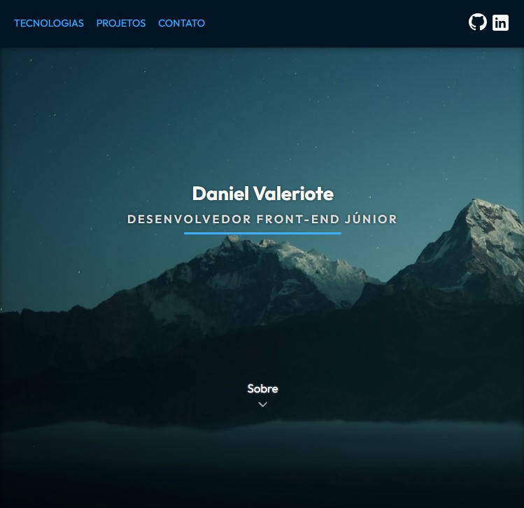

# Portfólio

## Pode ser acessado clicando **[aqui](https://danielvaleriote.github.io/portfolio/)**

Criado fazendo o uso principalmente de **Webpack**, **Javascript**, **SASS**, **Autoprefixer**, e **Babel**.

### NPM

### `npm start`

Roda o app em modo de desenvolvimento com **webpack-dev-server**.

### `npm run build`

Gera os arquivos de produção minificados na pasta **dist**.

### `npm run deploy`

Usa **gh-pages** para fazer o deploy dos arquivos de produção.
